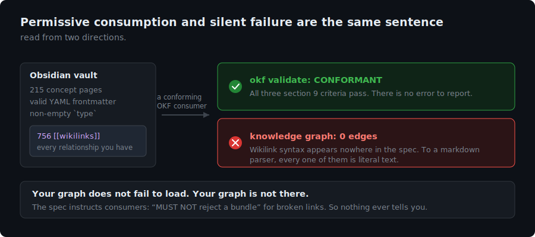
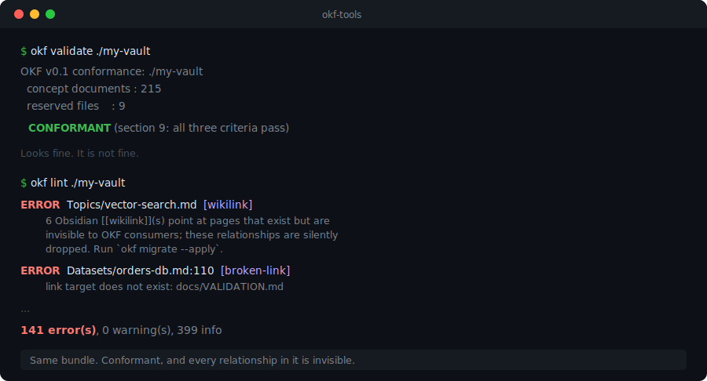

# okf-tools

**Validate, lint, migrate, and index [Open Knowledge Format](https://github.com/GoogleCloudPlatform/knowledge-catalog/tree/main/okf) bundles.**

[](https://github.com/astoreyai/okf-tools/actions/workflows/ci.yml)
[](LICENSE)
[](pyproject.toml)



OKF is a format for representing knowledge as a directory of markdown files with YAML
frontmatter: one file per concept, the file path is the concept's identity, and ordinary
markdown links turn the directory into a graph. It is designed so that anyone can produce it
without an SDK and anyone can consume it without an integration.

The OKF project ships a **reference agent** that *produces* bundles. `okf-tools` is for
everything after that: checking a bundle is conformant, catching the failures conformance
does not catch, and converting knowledge you already have into a bundle.

The reference agent does have a `Document.validate()`, but it runs at **write** time and
enforces four required frontmatter keys (`type`, `title`, `description`, `timestamp`), while
[SPEC.md §9](https://github.com/GoogleCloudPlatform/knowledge-catalog/blob/main/okf/SPEC.md)
requires exactly one: a non-empty `type`. The producer is stricter than the format, and
neither gives you a way to point at a bundle you already have and ask whether it conforms.

```bash
pip install git+https://github.com/astoreyai/okf-tools
```

```bash
okf validate ./my-bundle     # OKF v0.1 section 9 conformance
okf lint     ./my-bundle     # broken links, dropped relationships, forked concepts
okf migrate  ./my-vault      # Obsidian vault -> OKF bundle
okf index    ./my-bundle     # generate reserved index.md files
```

---

## Why a linter has to exist

The spec tells consumers to be permissive:

> "Consumers **MUST NOT** reject a bundle" for missing optional fields, unknown types,
> unrecognized keys, **broken links**, or missing index files.

That is the right call for interoperability and a hazard for authors, because it means
**a broken bundle is accepted in silence.**

Take the sharpest case. Obsidian and OKF are the same architecture: markdown, YAML
frontmatter, one file per concept, directory as graph. They differ on exactly one detail.

| | relationships expressed as |
|---|---|
| **Obsidian** | `[[wikilinks]]` |
| **OKF** | standard `[markdown](links.md)`, and only those |

Wikilink syntax appears nowhere in the spec. So point a conforming consumer at a
wikilink-based vault and it will ingest every file, report **no error**, and see a knowledge
graph with **zero edges**. Your links become literal text. Nothing tells you.

`okf validate` will not catch that: the bundle *is* conformant. `okf lint` will.



Every rule in the linter is a failure that is invisible to conformance, invisible to a
conforming consumer, and therefore invisible to you.

---

## `okf validate`

OKF v0.1 section 9 asks exactly three things of a bundle:

1. every non-reserved `.md` file contains parseable YAML frontmatter
2. every frontmatter block contains a non-empty `type` field
3. reserved filenames (`index.md`, `log.md`) follow their structures when present

`type` is the **only required field**. That is deliberate: the spec defines the
interoperability surface, not the content model. It also means conformance is a low bar, and
passing it says much less about a bundle than people assume.

```
$ okf validate ./my-bundle
OKF v0.1 conformance: ./my-bundle
  concept documents : 215
  reserved files    : 9

  CONFORMANT (section 9: all three criteria pass)
```

## `okf lint`

| Rule | Severity | Catches |
|---|---|---|
| `broken-link` | error | a link target that does not exist. The spec tells consumers not to reject these, so they rot forever. |
| `wikilink` | error | `[[wikilinks]]` pointing at pages that exist. Invisible to OKF: the relationship is silently dropped. |
| `nested-link` | error | a markdown link nested inside another link's URL, the classic auto-linker bug. |
| `missing-type` | error | the one required field. |
| `unparseable-frontmatter` | error | malformed YAML. |
| `link-escapes-bundle` | error | a link resolving outside the bundle root. |
| `frontmatter-delimiter-in-value` | warning | a value containing `---` (see below). |
| `duplicate-concept` | warning | the same concept written twice under different titles. |
| `wanted-page` | info | a wikilink to a page that was never written. Not convertible; it is a page you have not written yet. |
| `missing-recommended` | info | `title`, `description`, `resource`, `tags`, `timestamp`. |
| `orphan` | info | no inbound links. |

### The `---` trap

A concept titled `etl - Nightly Loader` slugifies to `etl---nightly-loader`. A producer that
stamps the slug into an `id` emits a **perfectly valid** document whose frontmatter *contains*
`---`. Any consumer that splits on the **substring** `---` instead of on a **line equal to**
`---` cuts that document in half and reports a corruption that does not exist.

`okf-tools` parses by line, and `okf lint` warns you when your bundle contains the trap so
you do not have to find out from someone else's parser.

### The duplicate-concept trap

If your page identity derives from a model-written title, an LLM will reword the title on the
next run and you will get a second page instead of an update:

```
"G0 Fix List for Review"  ->  g0-fix-list-for-review.md
"Review G0 Fix List"      ->  review-g0-fix-list.md      # same concept, forked
```

**A duplicate page is not a broken link**, so nothing reports it. `okf lint` keys on the
`resource` plus the significant-word bag of the title, which collapses reorderings without
falsely merging genuinely distinct concepts.

## `okf migrate`

Converts an Obsidian vault into an OKF bundle: `[[wikilinks]]` become standard markdown
links, and the recommended fields (`description`, `timestamp`) are derived from data the
document already carries.

```
$ okf migrate ./my-vault --apply
Obsidian -> OKF migration: APPLIED
  files changed         : 164
  wikilinks converted   : 508
  description added     : 125
  timestamp added       : 164
```

Dry run by default. Two guarantees:

- **An unresolvable wikilink is never converted.** It points at a page that does not exist;
  converting it would create a dead link, and OKF consumers tolerate dead links in silence, so
  nothing would ever tell you. It stays as-is and is reported as a wanted page.
- **Nothing is invented.** A `description` is lifted from prose the document already has (code
  fences excluded, so a mermaid diagram does not become your summary). If there is no honest
  source for a field, the field is omitted. A conforming consumer must not reject a document
  for a missing optional field, so omission is always safe and fabrication never is.

Obsidian renders standard markdown links natively (**Settings → Files & Links →** turn off
*"Use [[Wikilinks]]"*), so your vault and graph view keep working. This is not a one-way door.

## `okf index`

Generates the reserved `index.md` files OKF uses for progressive disclosure: no frontmatter,
body of `* [Title](url) - description`. A file named `_index.md` (leading underscore) has no
meaning in OKF and is treated as an ordinary concept document, so vaults that use `_index.md`
as a folder note can keep them; the two coexist.

---

## Library

```python
from pathlib import Path
from okf_tools import validate, lint, migrate, build_indexes

report = validate(Path("bundle"))
if not report.conformant:
    for f in report.failures:
        print(f"criterion {f.criterion}: {f.path}: {f.message}")

for finding in lint(Path("bundle")):
    print(finding.severity, finding.rule, finding.path, finding.message)
```

## Testing

The fixtures are the **OKF project's own reference bundles** (`ga4`, `crypto_bitcoin`,
`stackoverflow`), vendored from `GoogleCloudPlatform/knowledge-catalog` under Apache-2.0.
Testing a format tool against bundles written by the people who wrote the format is the only
test that means much: if this tool disagrees with them, this tool is wrong.

```bash
pip install -e ".[dev]"
pytest
```

## Status

`okf-tools` targets **OKF v0.1**. The spec is explicitly versioned and designed for
backward-compatible growth, so expect this to track it. Issues and PRs welcome, especially
from anyone consuming OKF bundles in anger: the linter is only as good as the failure modes
people have actually hit.

## License

Apache-2.0, matching the OKF specification.
