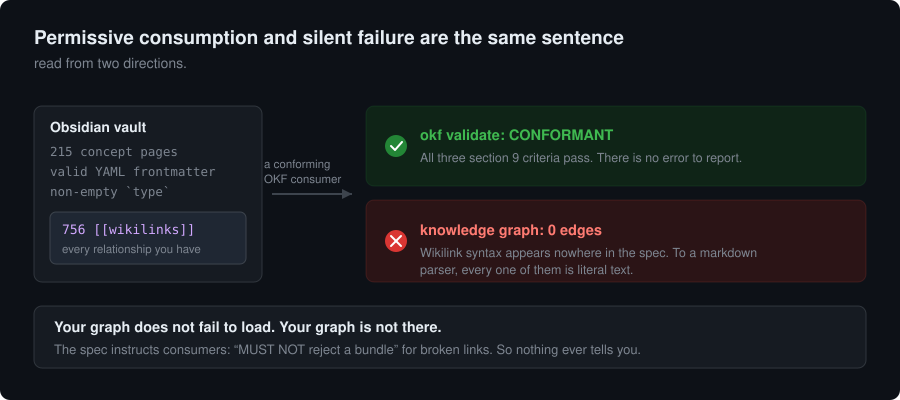
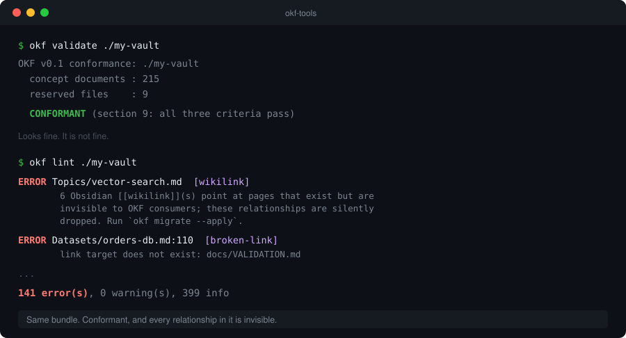

# okf-tools

**Validate, lint, migrate, and index [Open Knowledge Format](https://github.com/GoogleCloudPlatform/open-knowledge-format) bundles.**

[](https://github.com/astoreyai/okf-tools/actions/workflows/ci.yml)
[](LICENSE)
[](pyproject.toml)


OKF is a format for representing knowledge as a directory of markdown files with YAML
frontmatter: one file per concept, the file path is the concept's identity, and ordinary
markdown links turn the directory into a graph. It is designed so that anyone can produce it
without an SDK and anyone can consume it without an integration.

The OKF project ships a **reference agent** that *produces* bundles. `okf-tools` is for
everything after that: checking a bundle is conformant, catching the failures conformance
does not catch, and converting knowledge you already have into a bundle.

The reference agent validates at **write** time, and since v0.2 it enforces exactly what
[SPEC.md §11](https://github.com/GoogleCloudPlatform/open-knowledge-format/blob/main/SPEC.md)
requires — a non-empty `type`. What neither it nor the spec gives you is a way to point at a
bundle you already have, or one that arrived from somewhere else, and ask whether it holds up.

```bash
pip install git+https://github.com/astoreyai/okf-tools
```

```bash
okf validate tests/fixtures/acme_retail   # OKF v0.2 section 11 conformance
okf lint     tests/fixtures/acme_retail   # links, attestation, freshness, metadata
okf migrate  tests/fixtures/acme_retail   # preview; --apply explicitly enables writes
okf index    tests/fixtures/crypto_bitcoin # preview the complete index hierarchy
```

These commands use the published reference bundles included in a checkout. The core
and optional stdio MCP server both require Python 3.11+ on POSIX systems.

---

## Why a linter has to exist

The spec tells consumers to be permissive:

> "Consumers **MUST NOT** reject a bundle" for missing optional fields, unknown types,
> unrecognized keys, **broken links**, or missing index files.

That is the right call for interoperability and a hazard for authors, because it means
**a broken bundle is accepted in silence.**

v0.2 widened that hazard rather than narrowing it. The conformance criteria did not change —
§11 asks the same three things v0.1 §9 did — while the format gained an entire vocabulary for
trust: `sources` and their credibility signals, `generated` and `verified`, `status` and
`stale_after`, and the `Attested Computation` type with its `executor` and `attester`. All of
it optional. None of it checked by conformance.

### The sharp case: an attestation chain that points at nothing

An Attested Computation exists so a consumer can confirm a number was produced by running the
sanctioned computation rather than SQL the agent improvised. The chain runs through two
frontmatter paths — `executor.resource` names the run instructions, `attester.resource` names
the deterministic code that checks the receipt.

Those are links. They are just not *markdown* links, so no link checker has ever looked at
them. Break all three paths in a real bundle and conformance is untouched:

```
$ okf validate ./bundle
  CONFORMANT (section 11: all three criteria pass)
```

The bundle still advertises that its revenue figure is attested. The attester does not exist.
`okf lint` is what tells you:

```
$ okf lint ./bundle
ERROR   computations/revenue-ytd.md  [broken-frontmatter-path]
        `executor.resource` points at a path that does not exist: skills/DOES-NOT-EXIST.md
ERROR   computations/revenue-ytd.md  [broken-frontmatter-path]
        `attester.resource` points at a path that does not exist: attesters/NO-SUCH-ATTESTER.py
ERROR   computations/revenue-ytd.md  [broken-frontmatter-path]
        `sources[0].resource` points at a path that does not exist: policies/GONE.md
```

The same shape recurs across the trust families. A human signs off as `verified: { by: jsmith }`
instead of `human:jsmith`, and because §5.3 trust tiers key off the `human:` prefix, the
concept silently reads as machine-confirmed — a human reviewed it and the bundle no longer
says so.

### The other sharp case: a graph with no edges

Obsidian and OKF are the same architecture: markdown, YAML frontmatter, one file per concept,
directory as graph. They differ on exactly one detail.

| | relationships expressed as |
|---|---|
| **Obsidian** | `[[wikilinks]]` |
| **OKF** | standard `[markdown](links.md)`, and only those |

Wikilink syntax appears nowhere in the spec. So point a conforming consumer at a
wikilink-based vault and it will ingest every file, report **no error**, and see a knowledge
graph with **zero edges**. Your links become literal text. Nothing tells you.



`okf validate` will not catch that: the bundle *is* conformant. `okf lint` will.



Every rule in the linter is a failure that is invisible to conformance, invisible to a
conforming consumer, and therefore invisible to you.

---

## `okf validate`

OKF v0.2 section 11 asks exactly three things of a bundle:

1. every non-reserved `.md` file contains parseable YAML frontmatter
2. every frontmatter block contains a non-empty `type` field
3. reserved filenames (`index.md`, `log.md`) follow their structures when present

`type` is the **only required field**, in v0.2 exactly as in v0.1. That is deliberate: the
spec defines the interoperability surface, not the content model. It also means conformance is
a low bar, and passing it says much less about a bundle than people assume.

Criterion 3 enforces the MUSTs of §8 and §9 and nothing beyond them:

- An `index.md` carries no frontmatter — except a **bundle-root** `index.md`, which may
  declare `okf_version` (§8, §12). That is the only place frontmatter is permitted in an index.
- A `log.md` uses ISO 8601 `YYYY-MM-DD` date headings (§9). Nothing in §9 forbids frontmatter
  on a log, and the reference bundle ships one carrying `type: Log`.

```
$ okf validate tests/fixtures/acme_retail
OKF v0.2 conformance: /mnt/projects/okf-tools/tests/fixtures/acme_retail
  concept documents : 9
  reserved files    : 8

  CONFORMANT (section 11: all three criteria pass)
```

Everything v0.2 added is checked by `lint`, not here. A bundle whose attester points at
nothing is conformant, and saying otherwise would be inventing a rule the spec does not have.

## `okf lint`

### Links and the graph

| Rule | Severity | Catches |
|---|---|---|
| `broken-link` | error | a link target that does not exist. The spec tells consumers not to reject these, so they rot forever. |
| `broken-frontmatter-path` | error | a §6.2 path field (`attester.resource`, `executor.resource`, `computation`, `sources[].resource`, `resource`) pointing at a file that does not exist. |
| `invalid-link-path` | error | a malformed path or a link escaping the bundle root. |
| `invalid-frontmatter-path` / `ambiguous-frontmatter-path` | error | a malformed, escaping, or ambiguous path-valued metadata field. |
| `wikilink` | error | `[[wikilinks]]` pointing at pages that exist. Invisible to OKF: the relationship is silently dropped. |
| `ambiguous-wikilink` | error | multiple candidate concepts; use an explicit path instead of guessing. |
| `wanted-page` | info | a wikilink to a page that was never written. Not convertible; it is a page you have not written yet. |
| `orphan` | info | no inbound links. |

### Provenance and attribution (§5.1)

| Rule | Severity | Catches |
|---|---|---|
| `incomplete-source` | error | a `sources` entry with no `resource`, which is REQUIRED within an entry. |
| `dangling-footnote` | error | a `[^label]` with no definition **and** no matching `sources[].id` — the attribution resolves to nothing. |
| `uncited-source` | info | a declared `sources[].id` that nothing cites, in a document that cites other sources by footnote. The trace a renamed id leaves. |
| `unframed-usage-count` | info | a `usage_count` with no `usage_window` framing it, so the number has no period attached. |

### Trust and lifecycle (§5.2–§5.5, §7)

| Rule | Severity | Catches |
|---|---|---|
| `incomplete-generated` | error | `generated` with no `by`, which is REQUIRED within it. |
| `incomplete-verified` | error | a verification event with no actor. |
| `invalid-stale-after` | error | a relative duration or invalid/naive timestamp where an absolute ISO 8601 instant is required. |
| `nonconventional-actor` | warning | an actor matching no §7 form. The `human:` prefix is load-bearing: without it a human sign-off reads as machine-confirmed. |
| `unknown-status` | warning | a `status` outside draft / stable / deprecated. |
| `stale` | warning | the concept is past its own `stale_after`. |
| `legacy-timestamp` | info | `timestamp` without `generated`; v0.1 vocabulary a v0.2 consumer only *may* fall back to. |
| `missing-provenance` | info | no `generated` at all — nothing records who or what produced the concept. |

Current timestamps require an explicit UTC offset. Historical date-only values remain
supported at UTC midnight; naive datetimes are diagnosed rather than compared to aware
timestamps. Freshness is evaluated at an instant, not by truncating timestamps to dates.

### Attested computations (§10)

| Rule | Severity | Catches |
|---|---|---|
| `missing-runtime` | error | `type: Attested Computation` without `runtime`, which defines what `parameters` even mean. |
| `missing-computation` | error | neither a `computation` path nor a body `# Computation` section, so there is nothing to attest. |
| `incomplete-executor` / `incomplete-attester` | error | an `executor` or `attester` block with no `resource`. |
| `ambiguous-computation` | warning | both a `computation` path and an inline fence, so which one the attester compares against is unclear. |

### Structure and hygiene

| Rule | Severity | Catches |
|---|---|---|
| `missing-type` | error | the one required field. |
| `unparseable-frontmatter` | error | malformed YAML. |
| `invalid-metadata-shape` | error, or warning for optional tags | malformed known metadata; unknown extension fields remain opaque. |
| `invalid-timestamp` / `invalid-usage-window` | error | malformed timestamps or a usage window whose start follows its end. |
| `frontmatter-delimiter-in-value` | warning | a value containing `---` (see below). |
| `duplicate-concept` | warning | the same concept written twice under different titles. |
| `missing-recommended` | info | `title`, `description`, `resource`, `tags`. |

### The `---` trap

A concept titled `etl - Nightly Loader` slugifies to `etl---nightly-loader`. A producer that
stamps the slug into an `id` emits a **perfectly valid** document whose frontmatter *contains*
`---`. Any consumer that splits on the **substring** `---` instead of on a **line equal to**
`---` cuts that document in half and reports a corruption that does not exist.

`okf-tools` parses by line, and `okf lint` warns you when your bundle contains the trap so
you do not have to find out from someone else's parser.

### The duplicate-concept trap

If your page identity derives from a model-written title, an LLM will reword the title on the
next run and you will get a second page instead of an update:

```
"G0 Fix List for Review"  ->  g0-fix-list-for-review.md
"Review G0 Fix List"      ->  review-g0-fix-list.md      # same concept, forked
```

**A duplicate page is not a broken link**, so nothing reports it. `okf lint` keys on the
`resource` plus the significant-word bag of the title, which collapses reorderings without
falsely merging genuinely distinct concepts. A pair where one side is `status: deprecated` is
the supersession §5.4 sanctions, not a fork, and is left alone.

### What the linter deliberately does **not** flag

A footnote whose label is not a `sources[].id` but which carries its own definition is left
alone. The reference bundles use plain `[^1]` footnotes for ordinary asides alongside id-keyed
attribution, so a "every footnote must be a source id" rule would fail the spec authors' own
work. The consequence is worth stating plainly: a **renamed** `sources[].id` is structurally
indistinguishable from an ordinary footnote and cannot be caught from the body side.
`uncited-source` is what catches it, from the frontmatter side.

## `okf migrate`

Converts an Obsidian vault into an OKF bundle: `[[wikilinks]]` become standard markdown
links, and recommended fields are derived from data the document already carries.

```
$ okf migrate tests/fixtures/acme_retail
Obsidian -> OKF migration: DRY RUN (nothing written; pass --apply)
  files changed         : 0
  wikilinks converted   : 0
```

Dry run by default. Two guarantees:

- **An unresolvable wikilink is never converted.** It points at a page that does not exist;
  converting it would create a dead link, and OKF consumers tolerate dead links in silence, so
  nothing would ever tell you. It stays as-is and is reported as a wanted page.
- **Nothing is invented.** A `description` is lifted from prose the document already has (code
  fences excluded, so a mermaid diagram does not become your summary). If there is no honest
  source for a field, the field is omitted.

Resolution prefers explicit and document-relative paths, then a unique global filename,
title, or alias. Fragments are preserved. Ambiguous targets are reported with all candidates
and left untouched. Code spans, fences, HTML, and transclusions are not rewritten as prose
links. Documents with malformed metadata or no trustworthy `type` are skipped and reported.
Migration preserves body text and metadata scalar whitespace; it never flattens literal SQL
or manufactures a type. Existing frontmatter bytes are retained when no fields are added.

### Why `--actor` exists

v0.2 supersedes `timestamp` with `generated: { by, at }`, and `by` is REQUIRED within it. A
vault carries a modification date but no actor — the file does not record who wrote it, and
this tool did not. Inventing one would break the second guarantee, so it is the one field you
have to supply.

With `--actor human:<id>`, a full `generated` is written. Without it, the derived date is
written as the legacy `timestamp`, which §13.1 explicitly permits a v0.2 consumer to fall back
to. The default is spec-legal and never fabricates an author.

Obsidian renders standard markdown links natively (**Settings → Files & Links →** turn off
*"Use [[Wikilinks]]"*), so your vault and graph view keep working. This is not a one-way door.

## `okf index`

Generates the reserved `index.md` files OKF uses for progressive disclosure: no frontmatter,
body of `* [Title](url) - description`. A bundle-root `index.md` declaring `okf_version` keeps
that declaration across regeneration — it is the one piece of index frontmatter the spec
permits, and overwriting it would silently drop the bundle's own version statement.

A file named `_index.md` (leading underscore) has no meaning in OKF and is treated as an
ordinary concept document, so vaults that use `_index.md` as a folder note can keep them; the
two coexist.

Every populated directory receives an index, including the bundle root and intermediate
directories containing only child directories. Parent indexes link to child indexes; direct
concepts, including underscore-prefixed files, remain discoverable. Reapplying an unchanged
plan performs no replacements. Titles and descriptions are escaped as Markdown text.

## Structured outcomes and automation

All four commands support `--format json`. The versioned envelope contains
`schema_version`, `tool`, `operation`, `bundle`, `status`, `exit_code`, `data`, and `error`.
Successful results and failures use the same shape; errors include a stable code and any
paths already applied. JSON previews contain complete proposed file contents, not text
preview truncations.

| Exit | Meaning |
|---|---|
| `0` | operation completed and its policy passed |
| `1` | conformance/lint policy failed, or migration has skipped, unresolved, or ambiguous work |
| `2` | invalid input, unsafe filesystem state, exceeded budget, or operational failure |

`okf lint --severity` filters text display only. `--fail-on error|warning|info` independently
sets the failing threshold; JSON always includes every finding. Existing integrations
relying on display filtering to change exit status must use `--fail-on` instead.

```bash
okf lint tests/fixtures/acme_retail --format json --fail-on warning
okf index tests/fixtures/crypto_bitcoin --format json
```

## Filesystem and resource boundary

Only existing directory roots are accepted. Descendant symlinks and non-regular files are
rejected, including symlinked write destinations. Reads and writes use POSIX descriptor-relative
operations with `O_NOFOLLOW`; this implementation does not claim Windows support.

Writers construct and validate their plans before applying them, stage all replacement
files, check expected original bytes, and atomically replace each destination. Existing
ordinary permission bits are preserved; new files start at `0600`. A bundle-wide rollback
is **not** promised: an interruption after a replacement can leave a partial application,
reported through `applied`. Keep a backup and exclude concurrent directory-tree mutation
while a request is running.

Default budgets are 10,000 scanned filesystem entries, 2 MiB per Markdown file, 64 MiB total input or write-plan
bytes, 64 KiB per line, 10,000 diagnostics/Markdown marks, and nesting depth 64. Python callers
can supply `Limits`; the MCP launcher exposes the same named limits as flags. Limit failures
are explicit errors, never silently truncated successful results.

## Read-only stdio MCP

```bash
pip install -e ".[mcp]"
okf-mcp --root "$PWD/tests/fixtures/acme_retail"
```

Configure an MCP client to launch `okf-mcp` with an absolute approved root; repeat `--root`
to allow additional directories. Client-supplied paths must resolve inside those roots.
The server exposes `validate_bundle`, `lint_bundle`, `preview_indexes`, and
`preview_migration`. Every tool accepts `path`; lint also accepts `fail_on`, and migration
accepts an optional `actor`. There is no apply, shell execution, network fetch, or bundle-code
execution tool.

The optional dependency is `mcp>=1.30,<2`. Its public `CallToolResult` support preserves both
`structuredContent` and native `isError` without reaching into private tool-manager state.
Public dispatch is bounded too, so unknown-tool and argument-validation errors retain the
shared envelope. Operational errors set `isError=true`; policy violations remain structured
results with `exit_code=1`. Output is capped at 1 MiB per tool result by default, adjustable
with `--max-response-bytes` (minimum 4,096); overflow returns `response_limit`. Protocol
traffic alone goes to stdout.

---

## Library

```python
from pathlib import Path
from okf_tools import load_bundle, validate, lint

snapshot = load_bundle(Path("tests/fixtures/acme_retail"))
report = validate(snapshot)
if not report.conformant:
    for f in report.failures:
        print(f"criterion {f.criterion}: {f.path}: {f.message}")

for finding in lint(snapshot):
    print(finding.severity, finding.rule, finding.path, finding.message)
```

`trust_tier` and `normalize_verified` implement the §5.3 tiers and the §5.2 bare-mapping
normalization that §11 makes a consumer MUST, so a consumer built on this library gets both
without reimplementing them.

`load_bundle` lets multiple operations reuse one parsed snapshot while the bundle remains
unchanged. Invalid roots and resource failures raise `BundleError`; they do not produce
empty successful reports. `execute` exposes the same structured envelope used by the CLI
and MCP adapter.

## Testing

The historical fixtures are the **OKF project's own reference bundles** (`acme_retail`,
`ga4`, `crypto_bitcoin`, `stackoverflow`), vendored from
`GoogleCloudPlatform/knowledge-catalog` under Apache-2.0. Historical data remains unchanged.
`tests/fixtures/upstream.json` additionally pins the current canonical specification and
`acme_retail` documents from `GoogleCloudPlatform/open-knowledge-format` at commit
`ad30107c31c06aec8a7d5636e0d1058118604e6f`, with per-file SHA-256 hashes and source metadata.

Regressions use those real documents and traceable representation, removal, lifecycle,
and filesystem mutations. They cover current and historical timestamps, preservation,
ambiguity, path boundaries, budgets, CLI outcomes, and real stdio MCP
sessions. No fabricated business concepts, mock servers, or synthetic analysis data are used.

```bash
pip install -e ".[dev,mcp]" build
ruff check src tests
pytest -q
python -m build
```

## Status

`okf-tools` targets **OKF v0.2**. The spec is explicitly versioned and designed for
backward-compatible growth, so expect this to track it; v0.1 bundles are still read, and
`timestamp` and body `# Citations` lists are treated as the legacy forms §13.1 says they are.
Issues and PRs welcome, especially from anyone consuming OKF bundles in anger: the linter is
only as good as the failure modes people have actually hit.

This revision adds structured CLI outcomes, read-only MCP integration, bounded parsing and
filesystem access, conservative migration, complete hierarchical indexes, and source-derived
regressions. It also corrects the setuptools floor for PEP 639 license metadata and packages
the real fixtures in source distributions. Nothing is published or deployed by these tools.

## License

Apache-2.0, matching the OKF specification.
